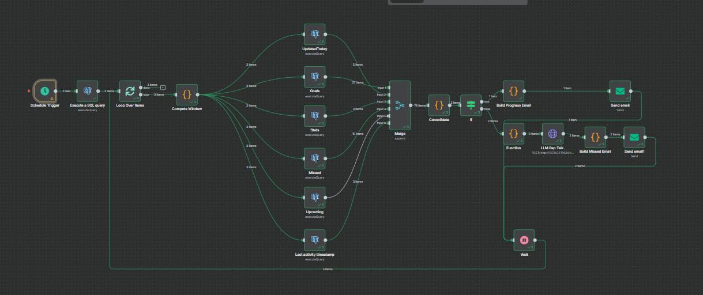
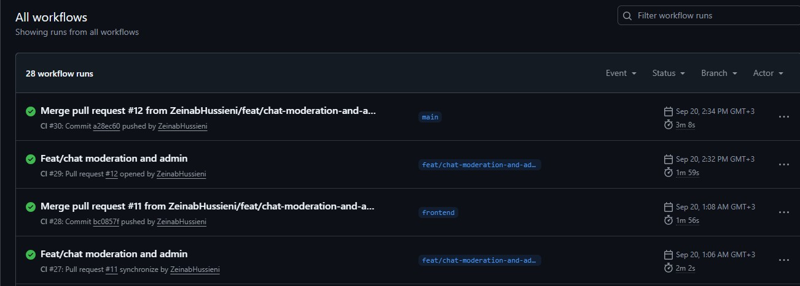

  

<!-- project overview -->

> DreamNest is an AI-powered web app that helps users visualize and achieve their goals. 
>
> It connects like-minded people based on personality, creates personalized step-by-step plans, and generates motivational visuals to keep them inspired.
> 
> With progress tracking and daily reminders.

  

<!-- System Design -->

### ER Diagram

### System Architecture

  

<!-- Project Highlights -->

### DreamNest Sexy Features

- ✨ AI Agent Planner
  DreamNest’s AI creates smart, personalized action plans for each goal. No generic steps your journey is uniquely mapped to keep you on track and motivated.
- 💬 Chat Hub
   Seamless real-time messaging powered by WebSockets. Stay connected with fast, reliable text chat safe, moderated, and always ready.
- 🎤 Voice, Images & Text Detection
  Send voice notes, share images, and chat freely. AI moderation ensures every conversation stays safe, respectful, and supportive.
- 📊 Dashboard & Notifications
  Live metrics and instant alerts. DreamNest keeps you updated in real time with WebSockets progress, posts, and community vibes all in one place.
- 🔄 n8n Automation
  Automated pep talks, reminders, and progress reports. DreamNest keeps the energy flowing so you never lose momentum on your goals.

  

<!-- Demo -->

### User Screens (Web)

| Login                                       | Register                                     |
| ------------------------------------------- | ---------------------------------------------|
|  |  |

| User Goals                                      |  Invites                                  |
| ----------------------------------------------- | ----------------------------------------- |
|  |  |

| Goal Creation                               | Goal Details                                  |
| ------------------------------------------  | --------------------------------------------- |
|  |  |

| User Posts                              |  User Dashboard                           |
| --------------------------------------- | ----------------------------------------- |
|      |  |

| Chat Page                              |  Dark mode                            |
| ---------------------------------------| ------------------------------------- |
|      |       |

| Responsive Screen                       |  Responsive Screen                    |
| --------------------------------------- | ------------------------------------- |
|   |  |

### Admin Screen (Web)

| Admin Dashboard                              | 
| ---------------------------------------------| 
|  | 

### Automation Workflow

| n8n                                          | 
| ---------------------------------------------| 
|     | 

  

<!-- Development & Testing -->

### Linear Board Screenshot
- Below is a screenshot of our Linear board, which we used to manage and track all project tasks during development:

Workflow steps:

- Create a ticket in Linear for each new feature, fix, or enhancement.
- Create a Git branch that follows Linear’s naming conventions.
- Commit changes with the corresponding task ID included in the commit message.
- Push the branch to the remote repository.
- Open a pull request and request a review.
- Merge the pull request once it has been reviewed and approved.
  

### Eraser Diagrams

For designing and maintaining our system and database diagrams, we relied on Eraser.

- Code-like diagrams → Every diagram is written in a structured text format, making it easy to track changes in version control.
- Lightweight & flexible → Quick to update and share without the need for complex design software.
- Team-friendly → Built for collaboration, allowing the whole team to contribute and refine diagrams smoothly.

[Eraser Link](https://app.eraser.io/workspace/knf1IWEgYhvckGNlIZQC?origin=share)
  

### CI Workflow

| CI                                      | CI                                    | 
| --------------------------------------- | ------------------------------------- | 
| |  | 

### Services, Validation and Testing
| Services                                     | Validation                                       | 
| ---------------------------------------------| ------------------------------------------------ | 
|  |  | 

| Testing Backend                                    | Testing Frontend                                  | 
| ---------------------------------------------------| ------------------------------------------------- | 
|  |  | 

  

### Development → Deployment Flow

**Feature Development**  
- Work on new features begins inside a local branch.  
- The branch is pushed to its remote equivalent on GitHub.  

**Integration to Staging**  
- The remote feature branch is merged into the staging branch.  
- This triggers GitHub Actions workflows.  

**CI on Staging**  
- GitHub Actions provisions a temporary PostgreSQL database.  
- Prisma migrations run, automated tests execute, and the NestJS backend is booted in a test environment.  
- If all checks pass, the pipeline continues.  

**Staging Deployment**  
- GitHub Actions pushes code to the staging EC2 instance.  
- A deployment script builds Docker containers for:  
  - NestJS backend  
  - React frontend  
  - PostgreSQL database  
  - Redis/WebSockets service  
- Containers spin up and serve the staging environment.  

**Production Release**  
- Once the feature is approved, the staging branch is merged into the main branch.  
- GitHub Actions reruns the same pipeline steps, but deployment is directed to the production EC2 instance.  

  

### Usage

- **Swagger UI** → Explore and test the API interactively in your browser. All endpoints are documented with parameters, request/response formats, and example bodies.  
- **Postman Collection** → Import our Postman collection to run API calls directly, perfect for quick testing and debugging.  
- **Auth-ready** → Add your JWT token once and easily access secured routes in both Swagger and Postman.  
- **Full Reference** → Endpoints are grouped by module (auth, goals, posts, chat, notifications) for easier navigation.  

| Swagger 1                                        | Swagger 2                                      | 
| ------------------------------------------------ | ---------------------------------------------- |
|     |  | 

| Postman 1                                      | Postman 2                                      |
| ---------------------------------------------- | ---------------------------------------------- |
|  |  |

  
