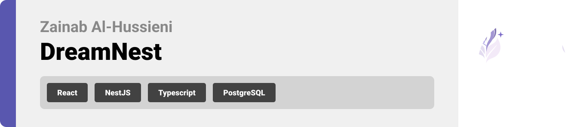

  

<!-- Project Overview -->

# DreamNest

**DreamNest is where your dreams turn into action.** ✨  
Write down your vision, and our AI transforms it into a personalized step-by-step plan to help you achieve it.  

But you won’t be alone on the journey. DreamNest’s **smart matching system** connects you with people who share similar goals or complementary skills. Once matched, you’ll unlock a **private chat space** where you can exchange text, voice notes, and images.  

Beyond one-to-one connections, you can:  
- Share updates in the **community feed**  
- Track your progress in a **personal dashboard**  
- Stay safe with **built-in AI moderation**  

Meanwhile, **admins** have their own dashboard to keep the environment secure, supportive, and positive.  

  

<!-- System Design -->
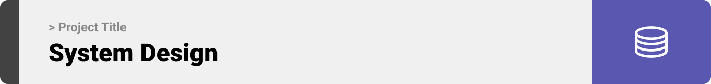

### ER Diagram

### System Architecture
|                                              | 
| ---------------------------------------------| 
| 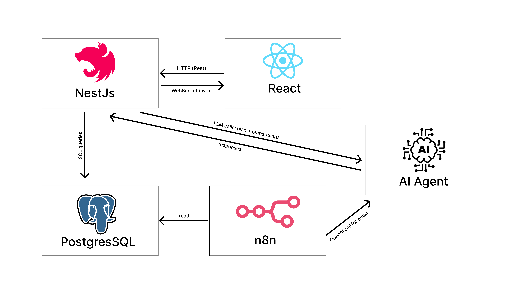| 

### Automation Workflow

| n8n                                          | 
| ---------------------------------------------| 
| 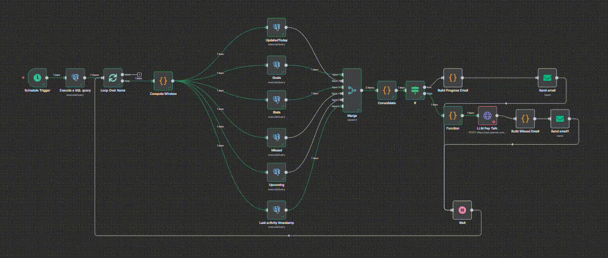            | 

  

<!-- Project Highlights -->

### DreamNest Sexy Features

- AI Agent Planner
  DreamNest’s AI creates smart, personalized action plans for each goal. No generic steps your journey is uniquely mapped to keep you on track and motivated.
-  Chat Hub
   Seamless real-time messaging powered by WebSockets. Stay connected with fast, reliable text chat safe, moderated, and always ready.
- Voice, Images & Text Detection
  Send voice notes, share images, and chat freely. AI moderation ensures every conversation stays safe, respectful, and supportive.
- Dashboard & Notifications
  Live metrics and instant alerts. DreamNest keeps you updated in real time with WebSockets progress, posts, and community vibes all in one place.
- n8n Automation
  Automated pep talks, reminders, and progress reports. DreamNest keeps the energy flowing so you never lose momentum on your goals.

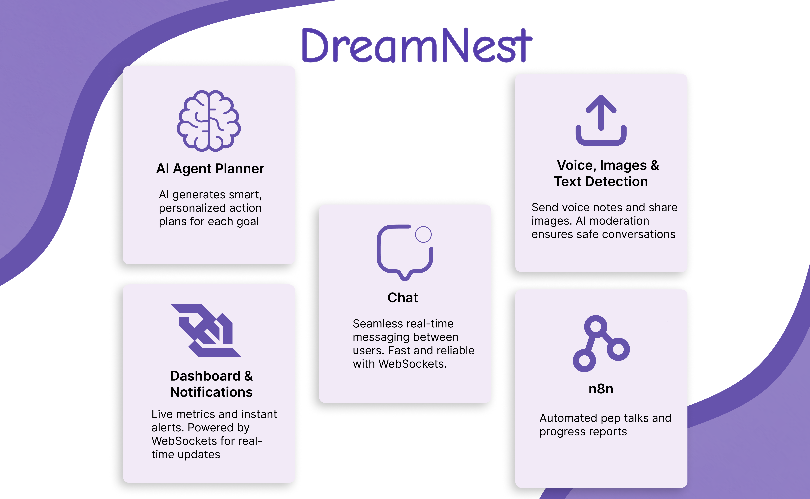

### Future Work  

-  **Mobile App**  
  Launch DreamNest on iOS & Android so users can stay connected and track progress anywhere.  

- **Timed Chat & Site Blocking**  
  Extend existing blocking features with timers, allowing temporary blocks to reduce distractions and boost focus.  

- **Coins & Unlockable Features**  
  Gamify the journey the more coins you earn, the more advanced features and rewards you can unlock.  
  

<!-- Demo -->
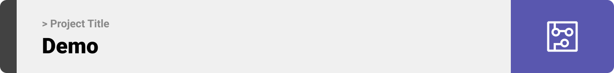

### User Screens (Web)

| Login                                       | Register                                     |
| ------------------------------------------- | ---------------------------------------------|
| 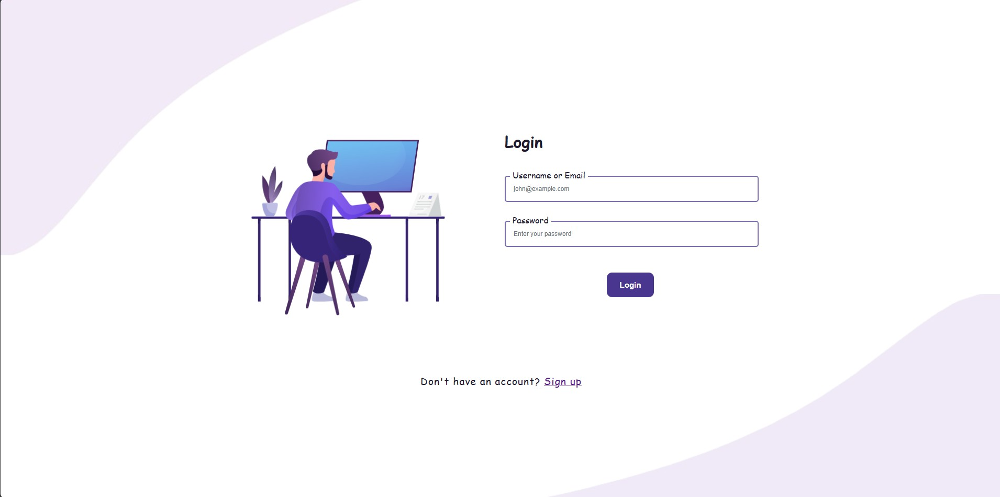 | 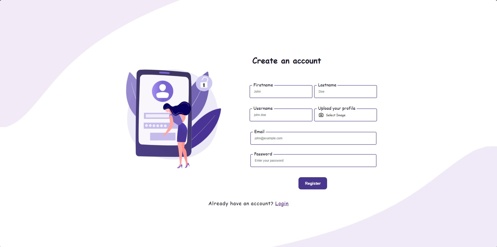 |

| User Goals                                      |  Invites                                  |
| ----------------------------------------------- | ----------------------------------------- |
| 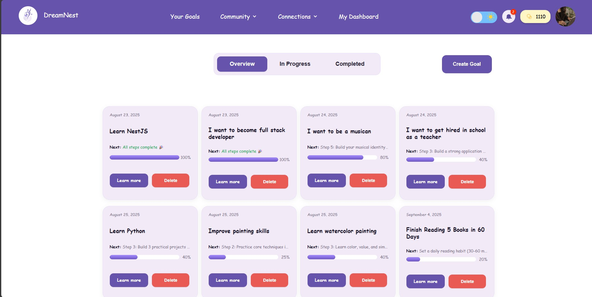 | 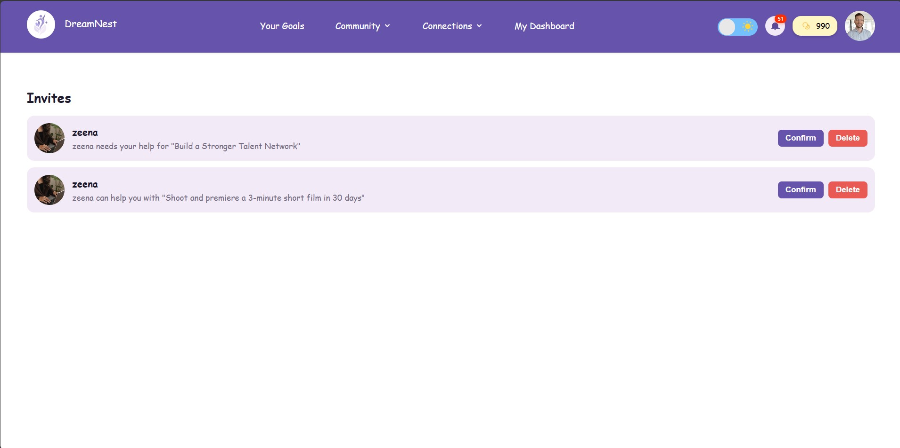 |

| Goal Creation                               | Goal Details                                  |
| ------------------------------------------  | --------------------------------------------- |
|  |  |

| User Posts                              |  User Dashboard                           |
| --------------------------------------- | ----------------------------------------- |
|      |  |

| Chat Page                              |  Dark mode                            |
| ---------------------------------------| ------------------------------------- |
|      |       |

| Responsive Screen                       |  Responsive Screen                    |
| --------------------------------------- | ------------------------------------- |
|   |  |

### Admin Screen (Web)

| Admin Dashboard                              | 
| ---------------------------------------------| 
|  | 

  

<!-- Development & Testing -->

### Linear Board Screenshot
- Below is a screenshot of our Linear board, which we used to manage and track all project tasks during development:

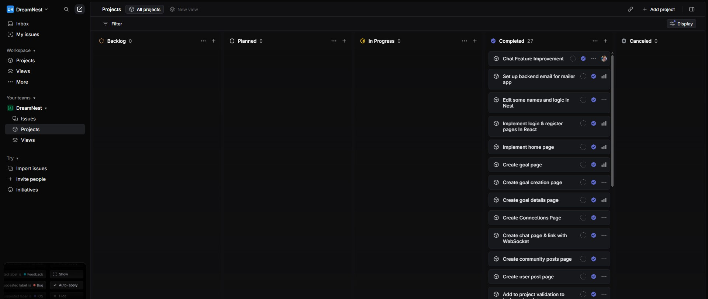

Workflow steps:

- Create a ticket in Linear for each new feature, fix, or enhancement.
- Create a Git branch that follows Linear’s naming conventions.
- Commit changes with the corresponding task ID included in the commit message.
- Push the branch to the remote repository.
- Open a pull request and request a review.
- Merge the pull request once it has been reviewed and approved.
  

### Eraser Diagrams

For designing and maintaining our system and database diagrams, we relied on Eraser.

- Code-like diagrams → Every diagram is written in a structured text format, making it easy to track changes in version control.
- Lightweight & flexible → Quick to update and share without the need for complex design software.
- Team-friendly → Built for collaboration, allowing the whole team to contribute and refine diagrams smoothly.

[Eraser Link](https://app.eraser.io/workspace/knf1IWEgYhvckGNlIZQC?origin=share)
  

### Services, Validation and Testing
| Services                                     | Validation                                       | 
| ---------------------------------------------| ------------------------------------------------ | 
| 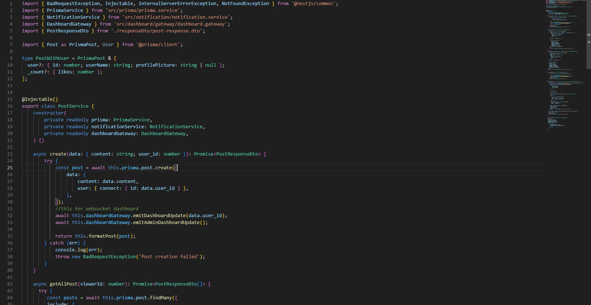 |  | 

| Testing Backend                                    | Testing Frontend                                  | 
| ---------------------------------------------------| ------------------------------------------------- | 
| 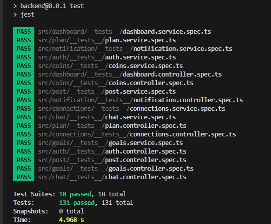 | 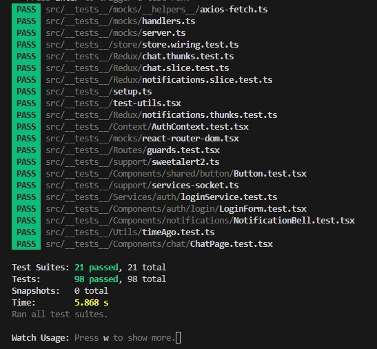 | 

### AI Agent

In DreamNest, the AI agent works like a **personal planning coach**.  
Its job is to take a user’s goal and turn it into a clear, step-by-step action plan that feels motivating and doable.  

Here’s how it works for the user:  

1. **The user chooses a goal**  
   Example: “Get fit in 3 months” or “Learn JavaScript.”  

2. **The agent creates a plan**  
   It breaks the user’s goal into 6–8 practical steps, each with:  
   - A short title (often with emojis 🎯✨)  
   - A motivational description (like a mini pep-talk)  
   - A realistic due date (spaced across weeks or months)  

3. **The plan gets refined automatically**  
   If anything is missing (like a date or description), the agent fills it in so the plan always feels complete and ready to follow.  

4. **The user’s plan is saved**  
   The final plan is attached to the user’s goal inside DreamNest so every time the user logs in, there is a roadmap that guides them forward step by step.  

 

| -----------------------------------------------------------------------------------------| 
|
                                                                        |
|   |
| 
                                                                                     | 

  

### Development → Deployment Flow

**Feature Development**  
- Work on new features begins inside a local branch.  
- The branch is pushed to its remote equivalent on GitHub.  

**Integration to Staging**  
- The remote feature branch is merged into the staging branch.  
- This triggers GitHub Actions workflows.  

**CI on Staging**  
- GitHub Actions provisions a temporary PostgreSQL database.  
- Prisma migrations run, automated tests execute, and the NestJS backend is booted in a test environment.  
- If all checks pass, the pipeline continues.  

**Staging Deployment**  
- GitHub Actions pushes code to the staging EC2 instance.  
- A deployment script builds Docker containers for:  
  - NestJS backend  
  - React frontend  
  - PostgreSQL database  
  - Redis/WebSockets service  
- Containers spin up and serve the staging environment.  

**Production Release**  
- Once the feature is approved, the staging branch is merged into the main branch.  
- GitHub Actions reruns the same pipeline steps, but deployment is directed to the production EC2 instance.  

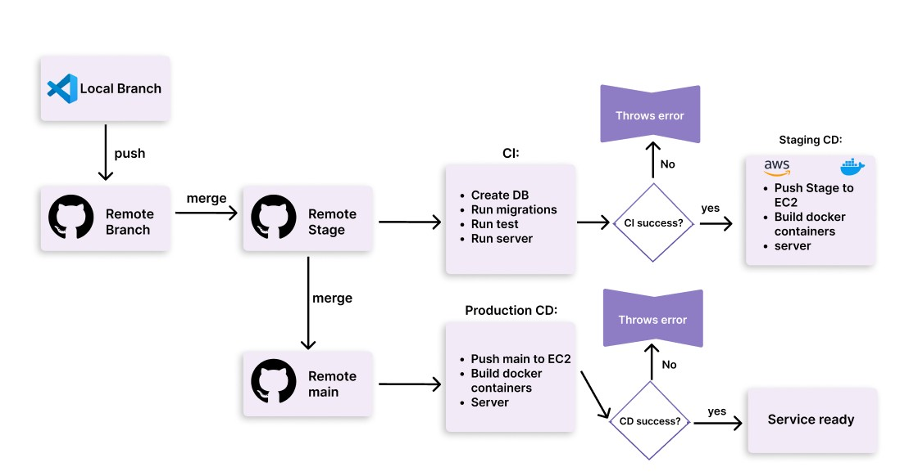

### Swagger & Postman Documentation

DreamNest provides a fully documented API that can be tested through **Swagger UI** or imported into **Postman**.  

- **Swagger UI** → Test endpoints directly in your browser with clear parameter, request, and response examples.  
- **Postman Collection** → Run API calls directly in Postman for fast debugging and local testing.  
- **Authentication Ready** → Add your JWT token once to easily access all secured endpoints.  
- **Organized Reference** → Endpoints are grouped by module (Auth, Goals, Posts, Chat, Notifications) for easy navigation.  

|Create Post `POST`                                | List Chatroom Messages `GET`                   | Notifications & Plans APIs                   | 
| ------------------------------------------------ | ---------------------------------------------- |----------------------------------------------| 
| 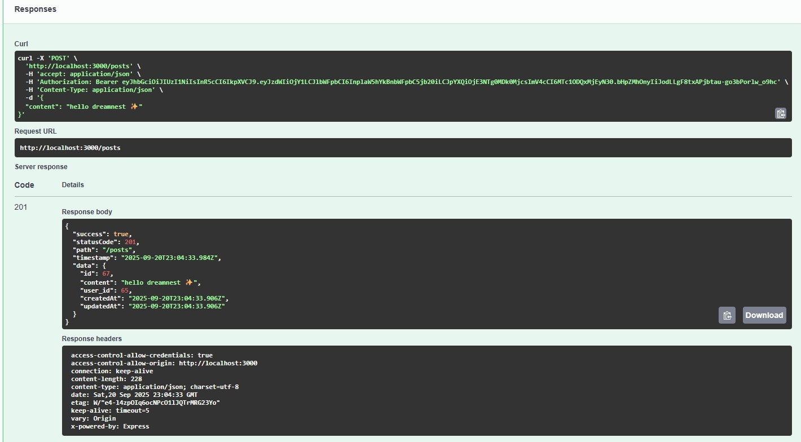    | 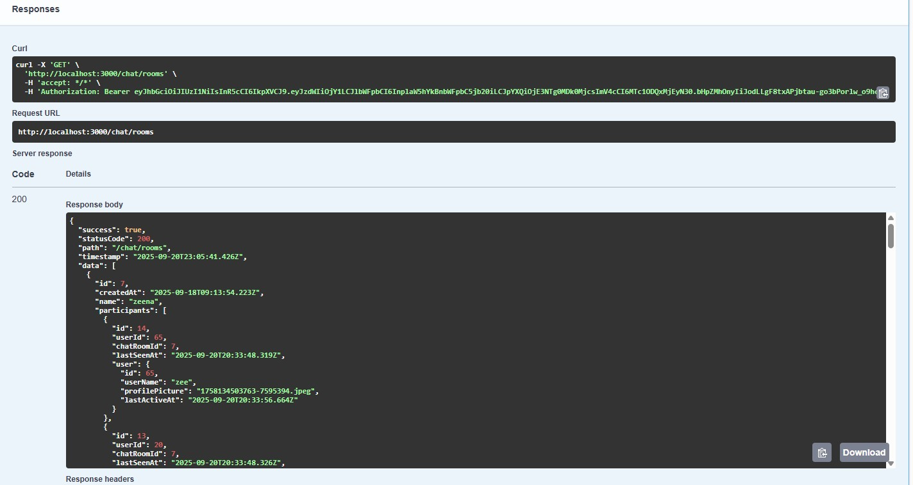 |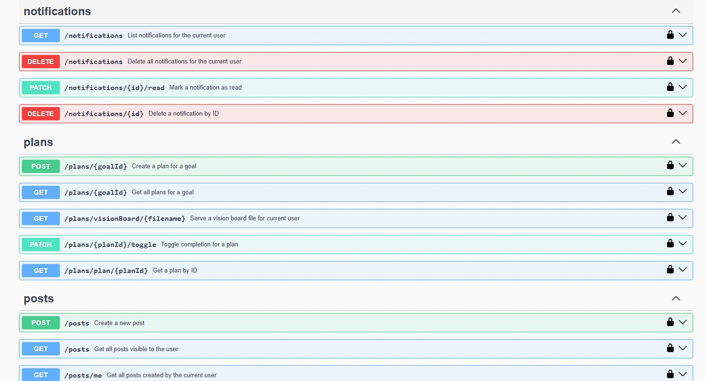| 

|  User Login `POST`                             | Admin Dashboard `GET`                          | Mark Notification as Read `PATCH`            | 
| ---------------------------------------------- | ---------------------------------------------- |----------------------------------------------| 
| 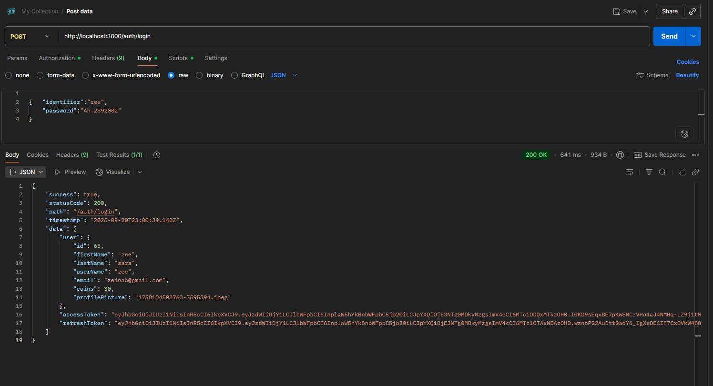 | 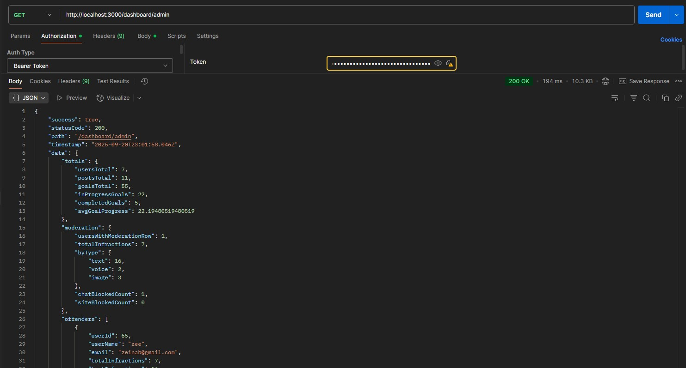 |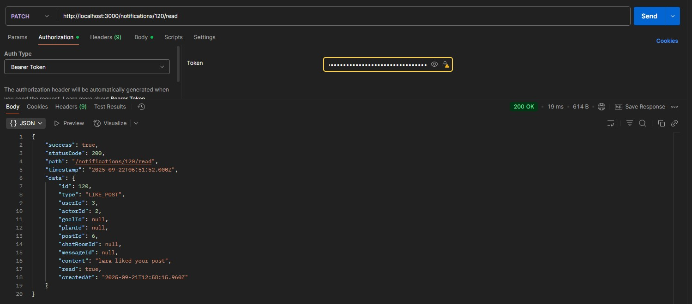  | 

  
